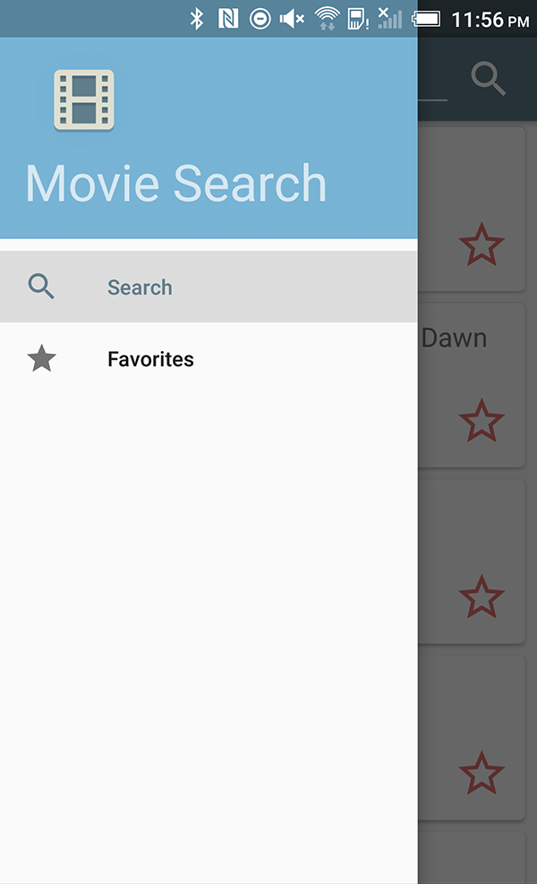
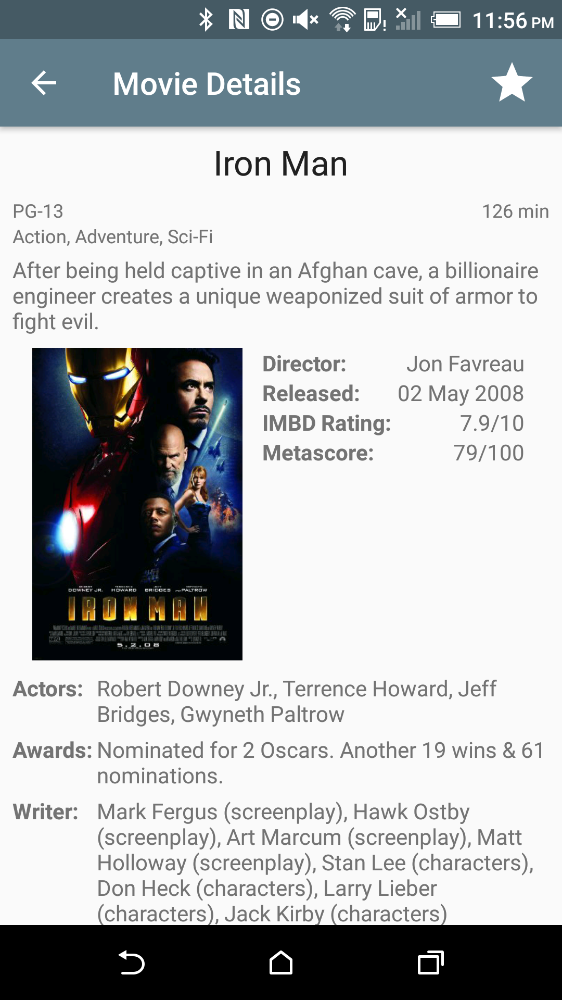

# Movie Search
**A movie search app for Android that uses Retrofit2, Realm, Gson, EventBus, Universal Image Loader.**  
(iOS version source <a href="https://github.com/romeroz/movie-search-ios">here</a>) 

See how to connect various Android libraries to bring together a beautiful app!

  
  
  

##Android technologies used: 
- Retrofit2: http://square.github.io/retrofit  
- Realm: https://realm.io/news/realm-for-android  
- Gson: https://github.com/google/gson  
- EventBus: https://github.com/greenrobot/EventBus  
- Universal Image Loader: https://github.com/nostra13/Android-Universal-Image-Loader  

##More information:
- Utilizes the free public OMDB API: http://www.omdbapi.com
- This app uses a NavigationDrawer with a ViewPager.  
- Supports device rotation without losing your data in a RecyclerView.  
- EventBus helps keep all activities/fragments in-sync with what is happening in the rest of the app. 